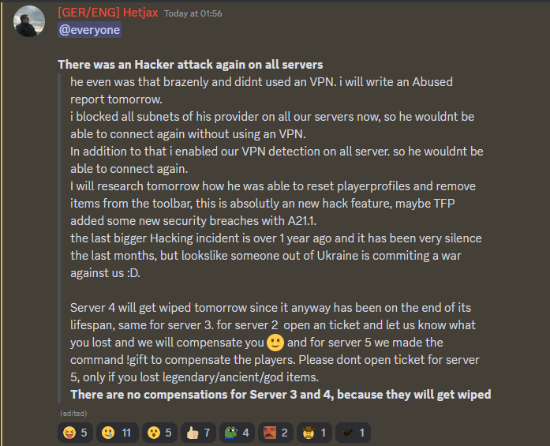
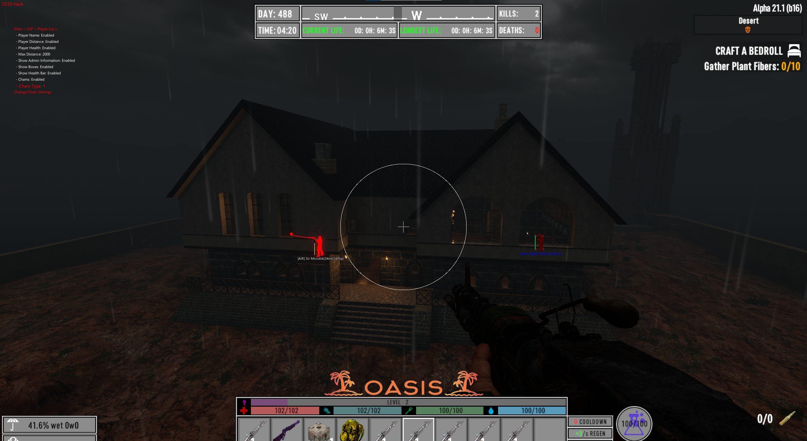
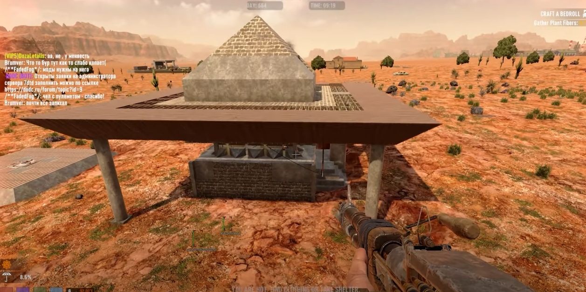
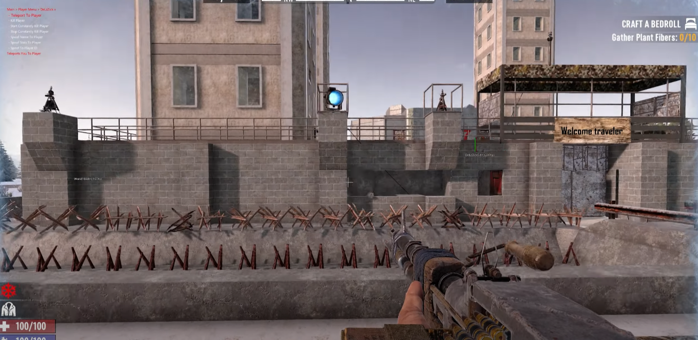

# 7DTD

  

  

## What is 7DTD?
_Releases are outdated_
 
This is a cheat for the game 7 days to die. An easy anti cheat secured unity game.
 
In this cheat I utilize mono in order to run the dll into memory and then use the the mono callbacks and mono functionality within the game to execute my code.
 
This project consists of a client,server(c++) and then a cheat(c#). The client and server use websockets and a basic aes256 encryption system to send data from the client to the server in order to create accounts, authenticate a user, send the cheat, load the cheat. Most of the code for this was written quite a few years ago but the other year i decided to rewrite it all and half way through got too fed up of it and just started stealing from my old project code. This is the result of some new code, Some old code. All in all it is rather messy and wasn't ever intended to see the light of day.
 
The cheat itself is very good, able to spawn items, kill off entire servers and all around cause complete caos. I am honestly rather fond of the cheat due to its ability to cause havoc on any server but thats mainly due to the game's poor networking systems. 

## The Cheat
[Outdated] 
So firstly lets talk about the anti cheat bypass. As of writing this the cheat is fully undetected on eac and has been for about 4-5 years.
We use a very simple exploit to access game memory, we utilize a .net 7's update which allows you to load references through the base directory allowing us to take a loaded reference/library and move its location to the base directory and edit it with a few IL calls to our cheat.
In this case i take the 0.harmony.dll from the managed folder and put it in the base folder and edit it to have the opcodes: call Globals.Auth and then ret.  
[Update 18/09/23]  
It appears after nearly 5 years of using this bypass it has been patched. It took effectively about 6 months of this project being open source and public to get the bypass patched. Circumventing their patch is trivial but for most people that don't understand how unity handles dll management that wont be the case. I don't exactly feel like spitting out EAC bypasses every few months so i won't be maintaining the EAC bypass. The game only had about 5 servers using EAC and most of them actually don't use EAC but actually just have EAC on the server which gives it an EAC flag so the game expects EAC running to connect to them. Therefore the handshake isn't needed and a heartbeat isn't established. This is an insanely easy thing to bypass. For real EAC servers you can basically just use the cheat on linux using the same method.  
 
With the bypass out of the way the cheat's functionality is efficient with a full set of aimbot and esp and weapon modifiers but mainly you can change your id and become another player (even on the server) as well as spoof your stats and break blocks in many different ways that bypass server sided anti cheats.
 
You can use my [UnityStealer](https://github.com/IntelSDM/UnityStealer) project to replicate this for the same effect. 
 

Due to obfuscation support you might notice that the code is rather messy. You may ask why Update() will call an Update1() or other callbacks call another function instead of just containing the code. This is due to obfuscation support so we can obfuscate the contents of the callback to hide them from an attacker without renaming the callback. Unity callbacks work by walking the monobehaviour's functions during their construction phase and then checking the method name compared to a string and then diverting the method address to be called within native memory under the correct callback handler. This means that those callback function names MUST be exact at runtime so we must exclude them from obfuscation.

## The Client
The client works rather well at sending the server information even if it is all over text. It works very well at what it was intended for even if it was mostly written a very long time ago. It uses xor encryption on strings and lazy imported on function calls to create a layer of protection and did initially use vmp on top of that. It has a heartbeat system too to annoy debuggers.

 
There is a lot of improvement needed, firstly the client could do with utilizing threading for messaging. It could do with a massive amount of work, data transactions firstly should all be classes sent into byte arrays and reconstructed on the server rather than just seperating text and decomposing it on the server side. The encryption is enough for morons but anyone with reverse engineering knowledge could figure out whats going on which is why tls 1.3 is very much needed. The client sends screenshots to the client to ensure authenticity of a user, this prevents anyone debugging the client. The client collects a firm set of hardware information to lock a user's account. 
 

## The Server
The server works very well at logging data with its own database system written using windows calls. This allowed me to easily sanitise the data to prevent against a string manipulation based attack. This was the foundation and implementation that gave me a lot of experience for my current DBMS that is in my current systems. The server can calulate product times in order to freeze a product and then unfreeze it to allow for downtime and maintenance without removing user subscription time. The server successfully streams all the required data perfectly for the user and locks the user's account to their hardware and allows this to be reset to new hardware information.
 
There are many ways to improve on this, firstly the data should be transferred using a none text method like I said before with the client. The client event handler should work in a much more objective way by initializing a new instance class with key words to active it. A console command system would also greatly improve such a system in order to have a command class that can add different commands with different derived actions. The file system of sending files should also use a dictionary of files in order to save memory with all those allocations of the same file in different database instances.

## Videos

 

## More Images:

  

  

  

